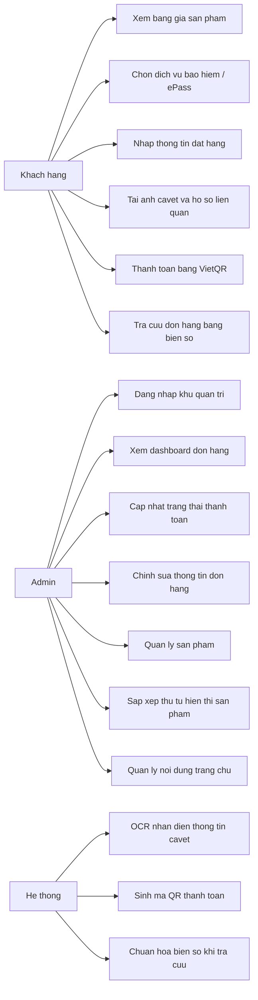
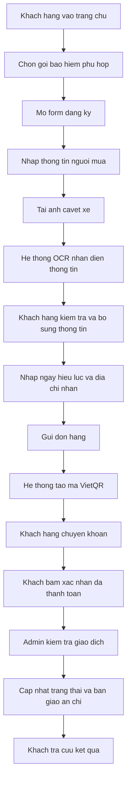
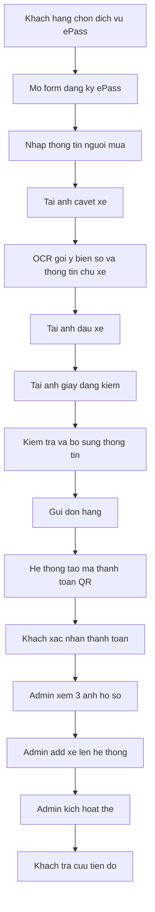
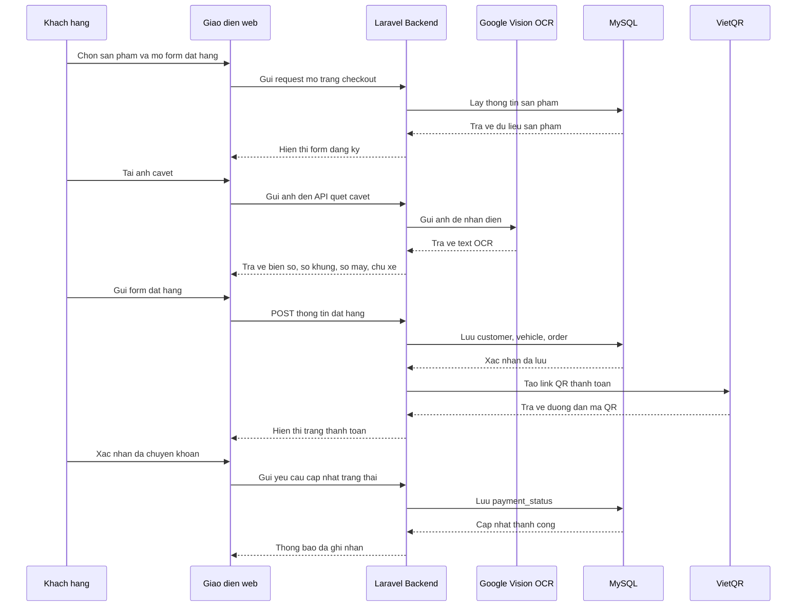
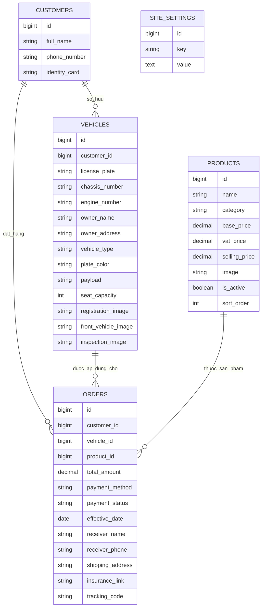

## LOI CAM ON

Truoc het, em xin gui loi cam on chan thanh den quy Thay, Co trong khoa da tan tinh giang day, truyen dat nhung kien thuc nen tang va chuyen sau trong suot qua trinh hoc tap mon Thuong mai dien tu. Nhung kien thuc ve mo hinh kinh doanh so, quy trinh giao dich truc tuyen, to chuc van hanh he thong va trai nghiem nguoi dung da giup em co duoc nen tang de xay dung va hoan thien de tai nay.

Em xin dac biet cam on Giang vien phu trach mon hoc da dinh huong de tai, dua ra nhung gop y quy bau va tao dieu kien de em co the tiep can bai toan theo huong thuc te hon. Trong qua trinh thuc hien, em da nhan duoc su ho tro ve mat hoc thuat cung nhu cach tiep can van de mot cach co he thong, tu do nang cao kha nang phan tich nghiep vu, thiet ke giao dien va to chuc chuong trinh.

Ben canh do, em cung xin cam on gia dinh, ban be va nhung nguoi da dong vien, ho tro em trong qua trinh hoc tap va hoan thanh bai bao cao nay. Su dong hanh va khich le tu moi nguoi chinh la nguon dong luc lon de em no luc vuot qua nhung kho khan trong qua trinh phat trien he thong.

Mac du da co nhieu co gang, do han che ve thoi gian, kinh nghiem va pham vi de tai, bai bao cao chac chan van con ton tai mot so thieu sot. Em rat mong nhan duoc nhung y kien dong gop cua Thay, Co de co the tiep tuc hoan thien de tai tot hon trong tuong lai.

---

## LOI MO DAU BAN CHINH THUC

Trong ky nguyen chuyen doi so, thuong mai dien tu khong con gioi han trong linh vuc ban le hang hoa thong thuong ma da mo rong manh me sang linh vuc dich vu. Cac dich vu lien quan den xe o to nhu bao hiem bat buoc, dang ky the thu phi khong dung hay tra cuu ho so sau khi giao dich dang ngay cang can den nhung he thong so hoa de tang toc do xu ly, giam thao tac thu cong va nang cao trai nghiem nguoi dung.

Tren thuc te, qua trinh dang ky bao hiem hoac ePass tai nhieu don vi van con thuc hien theo cach roi rac: khach hang nhan bao gia qua tin nhan, gui giay to qua cac ung dung chat, nhan vien tu tong hop thong tin, nhap lai du lieu va doi chieu thanh toan thu cong. Cach lam nay khong chi ton thoi gian ma con de xay ra sai sot, gay kho khan cho ca khach hang lan don vi van hanh.

Xuat phat tu thuc te do, de tai "Xay dung website ho tro dang ky bao hiem o to va dich vu ePass tren nen tang Laravel" duoc thuc hien nham xay dung mot he thong web theo huong thuong mai dien tu mini, trong do khach hang co the xem bang gia, lua chon goi dich vu, gui ho so truc tuyen, thanh toan bang QR va tra cuu tien do don hang. Ve phia doanh nghiep, admin co the quan ly san pham, quan ly noi dung trang chu, kiem tra ho so va cap nhat trang thai xu ly tren mot dashboard tap trung.

Diem noi bat cua de tai khong chi nam o viec xay dung mot website co giao dien hien dai, ma con nam o kha nang tich hop nghiep vu thuc te nhu OCR nhan dien thong tin tu anh cavet xe, phan tach rieng luong bao hiem va ePass, ho tro thanh toan VietQR, sap xep thu tu san pham tren trang khach va bo sung co che CMS mini de quan tri noi dung ma khong can can thiep truc tiep vao ma nguon.

Thong qua de tai nay, nguoi thuc hien co co hoi van dung tong hop kien thuc da hoc trong mon Thuong mai dien tu va cac mon lien quan de giai quyet mot bai toan co gia tri ung dung thuc te. Dong thoi, de tai cung cho thay vai tro ngay cang quan trong cua viec ket hop giua ky thuat lap trinh, trai nghiem nguoi dung va tu duy van hanh he thong trong boi canh kinh doanh so hien nay.

---
# BAO CAO DO AN MON THUONG MAI DIEN TU

## DE TAI: XAY DUNG WEBSITE HO TRO DANG KY BAO HIEM O TO VA DICH VU EPASS TREN NEN TANG LARAVEL

---

## 1. THONG TIN CHUNG

- Ten de tai: Xay dung he thong website ho tro dang ky bao hiem o to va dich vu ePass
- Mon hoc: Thuong mai dien tu
- Nen tang phat trien: Laravel 12, PHP 8.2, MySQL, Vite, Bootstrap, CSS tuy bien
- Moi truong chay: XAMPP tren Windows
- Doi tuong su dung: Khach hang co nhu cau mua bao hiem bat buoc xe o to hoac dang ky dan the, doi the ePass; nhan vien admin xu ly ho so va theo doi don hang

---

## 2. LOI MO DAU

Trong boi canh chuyen doi so dien ra manh me, cac quy trinh dang ky dich vu xe o to nhu mua bao hiem bat buoc, dan the thu phi khong dung ePass, tra cuu tinh trang ho so va theo doi qua trinh ban giao an chi da khong con phu hop neu van thuc hien theo cach thu cong. Nguoi dung thuong phai lien he qua nhieu kenh khac nhau, gui giay to qua Zalo, nhan bao gia bang tin nhan, chuyen khoan thu cong roi tiep tuc hoi lai tien do xu ly. Ve phia don vi van hanh, nhan vien cung gap kho khan khi phai tong hop thong tin tu nhieu nguon, nhap lieu lap lai, de xay ra nham lan khi doc bien so xe, so khung, so may va thong tin chu xe.

Xuat phat tu bai toan thuc te do, de tai nay duoc thuc hien voi muc tieu xay dung mot website thuong mai dien tu mini giup dong bo hoa toan bo quy trinh tiep nhan ho so, bao gia, dat dich vu, thanh toan, tra cuu va quan tri don hang cho hai nhom dich vu chinh: bao hiem o to va ePass. He thong cho phep khach hang truy cap bang gia, lua chon goi phu hop, upload anh giay to xe, de he thong ho tro nhan dien thong tin bang OCR, sau do chuyen sang buoc thanh toan QR va theo doi trang thai ho so. Ben canh do, admin co the quan ly san pham, cap nhat noi dung trang chu, xem chi tiet don hang, kiem tra anh ho so va cap nhat tinh trang xu ly.

De tai khong chi mang y nghia lap trinh mot ung dung web thong thuong, ma con phan anh ro dac trung cua linh vuc thuong mai dien tu hien nay: toi uu hoa trai nghiem nguoi dung, tang kha nang tu dong hoa van hanh, ho tro thanh toan so, ca nhan hoa noi dung hien thi va xay dung he thong co tinh thuc te, co the mo rong de dua vao su dung trong moi truong doanh nghiep vua va nho.

---

## 3. LY DO CHON DE TAI

De tai duoc lua chon vi cac ly do sau:

Thu nhat, nhu cau mua bao hiem xe o to va dang ky ePass la nhu cau thuc te, co tinh thuong xuyen va gan voi doi song hien nay. Rat nhieu chu xe co nhu cau mua bao hiem bat buoc hoac dan the thu phi khong dung, nhung quy trinh tiep nhan va xu ly tai nhieu noi van con roi rac va phu thuoc nhieu vao thao tac thu cong.

Thu hai, de tai co tinh ung dung cao trong linh vuc thuong mai dien tu vi ket hop duoc nhieu thanh phan quan trong cua mot he thong kinh doanh online, bao gom hien thi san pham, quan ly noi dung, nhan don hang, thanh toan dien tu, tra cuu don hang va dashboard quan tri.

Thu ba, de tai cho phep van dung tong hop nhieu kien thuc da hoc trong mon Thuong mai dien tu va cac mon lien quan nhu phan tich thiet ke he thong, co so du lieu, lap trinh web, trai nghiem nguoi dung, thanh toan truc tuyen va bao mat du lieu.

Thu tu, de tai co kha nang mo rong trong tuong lai. He thong khong chi dung lai o muc mo phong hoc tap ma con co the phat trien tiep thanh mot san pham van hanh that su, bo sung cac tinh nang nhu dang nhap khach hang, thong bao tu dong, thong ke doanh thu, quan ly khuyen mai, luu lich su thao tac va tich hop them cac cong thanh toan khac.

---

## 4. MUC TIEU DE TAI

### 4.1. Muc tieu tong quat

Xay dung mot website ho tro cung cap dich vu bao hiem o to va ePass theo huong thuong mai dien tu, giup nguoi dung tra cuu bang gia, gui ho so online, thanh toan bang QR, theo doi tinh trang don hang; dong thoi giup admin quan ly san pham, noi dung trang chu va toan bo quy trinh xu ly don hang tren mot dashboard tap trung.

### 4.2. Muc tieu cu the

- Xay dung giao dien trang chu chuyen nghiep, hien dai, de su dung va phan loai ro rang cac nhom san pham.
- Ho tro hai luong nghiep vu rieng biet:
  - Mua bao hiem o to.
  - Dang ky dan the hoac doi the ePass.
- Ho tro upload anh giay dang ky xe, anh dau xe va anh giay dang kiem theo tung loai dich vu.
- Tich hop OCR de trich xuat mot phan thong tin tu anh cavet xe nham giam viec nhap lieu thu cong.
- Tich hop thanh toan bang VietQR.
- Cho phep khach hang tra cuu don hang theo bien so xe.
- Cho phep admin cap nhat trang thai don hang, chinh sua thong tin va theo doi hinh anh ho so.
- Xay dung co che CMS mini de admin co the cap nhat noi dung trang chu ma khong can sua code.

---

## 5. PHAM VI DE TAI

### 5.1. Pham vi chuc nang da thuc hien

He thong trong phien ban hien tai da thuc hien duoc cac nhom chuc nang chinh sau:

- Hien thi bang gia bao hiem o to theo nhom bien trang va bien vang.
- Hien thi danh muc dich vu ePass.
- Ho tro sap xep thu tu hien thi san pham tu dashboard admin.
- Cho phep admin them, sua, an, xoa san pham.
- Cho phep admin keo tha de sap xep thu tu san pham.
- Ho tro dat hang online voi quy trinh nhap thong tin, upload hinh anh, thanh toan va xac nhan.
- Ho tro OCR anh cavet de nhan dien bien so, so khung, so may, chu xe va dia chi.
- Ho tro luong mua bao hiem va luong ePass tach rieng theo nghiep vu.
- Ho tro hien thi QR thanh toan theo tung don hang.
- Ho tro tra cuu don hang bang bien so xe.
- Ho tro admin dang nhap va quan tri don hang.
- Ho tro admin cap nhat trang thai thanh toan va thong tin giao nhan.
- Ho tro admin chinh sua noi dung trang chu trong dashboard.

### 5.2. Pham vi chua thuc hien hoac co the mo rong

- Dang ky va dang nhap tai khoan khach hang.
- Thanh toan truc tiep qua cong thanh toan trung gian ngoai VietQR.
- Gui email tu dong hoac SMS cho khach hang.
- Bao cao doanh thu, thong ke chuyen doi, bieu do phan tich.
- Phan quyen nhieu cap cho nhan vien admin.
- Chat truc tuyen ho tro khach hang.

---

## 6. DOI TUONG VA MO HINH HOAT DONG CUA HE THONG

### 6.1. Doi tuong su dung

He thong huong den hai nhom nguoi dung chinh:

- Khach hang: la chu xe co nhu cau mua bao hiem xe o to hoac dang ky ePass.
- Quan tri vien admin: la nhan vien tiep nhan, kiem tra va xu ly don hang.

### 6.2. Mo hinh hoat dong

He thong duoc xay dung theo mo hinh B2C don gian. Don vi cung cap dich vu dua bang gia len website, khach hang truy cap, tim hieu, chon goi, gui thong tin ho so, thanh toan va theo doi tien do. Sau khi nhan duoc thanh toan, admin xu ly noi bo va cap nhat ket qua tren dashboard. Day la mo hinh rat phu hop voi thuong mai dien tu dich vu, noi trong tam khong chi la ban hang ma con la to chuc quy trinh sau ban hang mot cach thong nhat.

---

## 7. PHAN TICH YEU CAU NGHIEP VU

### 7.1. Nghiep vu mua bao hiem o to

Quy trinh mua bao hiem o to duoc to chuc theo cac buoc:

1. Khach hang truy cap trang chu, xem bang gia bao hiem.
2. Khach hang chon nhom xe phu hop voi bien so va muc dich su dung.
3. Khach hang mo trang dang ky va nhap thong tin ca nhan.
4. Khach hang tai anh giay dang ky xe.
5. He thong su dung OCR de goi y bien so, so khung, so may, ten chu xe, dia chi.
6. Khach hang bo sung thong tin neu can va nhap ngay bat dau hieu luc bao hiem.
7. He thong tao don hang va hien thi QR thanh toan.
8. Khach hang chuyen khoan va bam xac nhan da thanh toan.
9. Admin kiem tra giao dich, cap nhat trang thai don hang va ban giao an chi.
10. Khach hang quay lai trang tra cuu de theo doi ket qua.

### 7.2. Nghiep vu dang ky ePass

Quy trinh ePass co mot so diem khac biet voi bao hiem:

1. Khach hang chon dich vu dan the hoac doi the ePass.
2. Khach hang van tai anh cavet de he thong OCR nhan dien thong tin co ban va bien so.
3. Ngoai ra, khach hang phai tai them anh dau xe va anh giay dang kiem.
4. He thong khong yeu cau ngay bat dau hieu luc nhu bao hiem.
5. Sau khi gui thong tin, he thong tao don va sinh ma thanh toan QR.
6. Admin xem duoc day du cac anh trong dashboard de add xe len he thong va kich hoat the.

### 7.3. Nghiep vu quan tri noi dung

Admin co quyen cap nhat nhung noi dung hien thi o trang chu nhu:

- slogan va tieu de hero,
- cac diem nhan thong diep,
- noi dung 3 slide carousel,
- tieu de va mo ta cac section,
- hinh anh slide carousel.

Admin khong co quyen thay doi bo cuc, CSS, kich thuoc hay form trang. Cach thiet ke nay giup dam bao tinh on dinh ve mat giao dien trong khi van cho phep chinh sua noi dung theo chien dich kinh doanh.

---

## 8. PHAN TICH YEU CAU CHUC NANG

### 8.1. Chuc nang danh cho khach hang

- Xem trang chu va bang gia.
- Loc va nhan biet cac nhom san pham.
- Chon san pham de mua.
- Dien thong tin nguoi mua va phuong tien.
- Tai hinh anh ho so.
- Su dung OCR de ho tro dien nhanh.
- Thanh toan bang QR.
- Xac nhan da chuyen khoan.
- Tra cuu don hang theo bien so.

### 8.2. Chuc nang danh cho admin

- Dang nhap vao khu vuc quan tri.
- Xem danh sach don hang.
- Xem chi tiet tung don hang.
- Xem anh cavet, anh dau xe, anh dang kiem.
- Chinh sua thong tin don hang.
- Cap nhat trang thai don hang.
- Quan ly san pham.
- Keo tha sap xep thu tu hien thi san pham.
- An/hien san pham.
- Chinh sua noi dung trang chu.

---

## 9. PHAN TICH YEU CAU PHI CHUC NANG

He thong can dap ung mot so yeu cau phi chuc nang quan trong sau:

- Tinh de su dung: giao dien ro rang, thao tac ngan gon, noi dung de hieu.
- Tinh chinh xac: OCR can nhan dien duoc bien so o muc chinh xac kha tot, nhat la voi cac anh cavet thuc te.
- Tinh mo rong: he thong co kha nang them chuc nang moi trong tuong lai.
- Tinh bao mat: thong tin admin, token, API key va cau hinh nhay cam duoc dua vao file env.
- Tinh on dinh: khi xay ra loi OCR hoac loi thanh toan, he thong phai xu ly mem va khong lam vo trang.
- Tinh responsive: giao dien phai hien thi duoc tren desktop va man hinh nho.

---

## 10. CONG NGHE SU DUNG

### 10.1. Laravel 12

Laravel 12 duoc su dung lam framework chinh cho toan bo backend. Day la framework phu hop voi de tai vi co cau truc MVC ro rang, ho tro routing, middleware, validation, migration, Eloquent ORM va testing rat tot.

### 10.2. PHP 8.2

PHP 8.2 la ngon ngu lap trinh chay phia server, dung de xu ly request, quan ly nghiep vu, thao tac co so du lieu va sinh giao dien Blade.

### 10.3. MySQL

MySQL duoc dung de luu tru du lieu khach hang, xe, san pham, don hang va cac setting noi dung trang chu.

### 10.4. Blade Template

Blade duoc su dung de xay dung giao dien. Diem manh cua Blade la nhung du lieu dong vao HTML de dang, cau truc code gon va phu hop voi mo hinh MVC.

### 10.5. Vite va CSS tuy bien

Frontend su dung Vite de build asset hien dai. Ngoai ra, he thong dung CSS tuy bien ket hop Bootstrap de tao giao dien dep, responsive va co tinh nhan dien rieng.

### 10.6. Google Vision OCR

Google Vision duoc tich hop de phan tich anh cavet xe va nhan dien thong tin. Day la mot diem nhan ky thuat cua de tai vi giup giam thao tac nhap tay va toi uu hoa trai nghiem nguoi dung.

### 10.7. VietQR

VietQR duoc su dung de sinh ma thanh toan QR cho tung don hang. Cac noi dung nhu so tai khoan, ten tai khoan va ma chuyen khoan duoc dua vao QR de khach hang chuyen tien nhanh hon.

---

## 11. THIET KE HE THONG

### 11.1. Kien truc tong the

He thong duoc xay dung theo mo hinh MVC:

- Model: quan ly du lieu va ket noi database.
- View: hien thi giao dien cho khach hang va admin.
- Controller: dieu huong request, xu ly nghiep vu, validate du lieu va tra ve ket qua.

Ngoai ra, he thong con su dung middleware de bao ve khu admin, Form Request de validate input, migration de quan ly schema database va test de dam bao tinh on dinh.

### 11.2. Cac thanh phan controller chinh

- HomeController: xu ly trang chu.
- OrderController: xu ly dat hang, OCR, thanh toan QR, tra cuu don hang.
- AdminController: xu ly dang nhap admin, dashboard don hang, cap nhat thong tin va trang thai.
- AdminProductController: quan ly san pham.
- AdminHomepageContentController: quan ly noi dung trang chu.

---

## 11A. SO DO USE CASE CUA HE THONG

De lam ro moi quan he giua nguoi dung va he thong, de tai co the mo ta bang so do use case nhu sau:

### Nhan xet ve so do use case

So do use case cho thay he thong co hai nhom tac nhan ro rang la khach hang va admin. Khach hang tap trung vao thao tac mua dich vu, thanh toan va tra cuu. Admin tap trung vao xu ly van hanh, quan ly noi dung va dieu chinh danh muc san pham. Ben canh do, he thong dong vai tro tu dong hoa mot so tac vu quan trong nhu OCR, sinh QR thanh toan va chuan hoa bien so.

---

## 11B. SO DO HOAT DONG CHO QUY TRINH MUA BAO HIEM

Quy trinh mua bao hiem co the mo ta bang activity diagram sau:

### Y nghia cua quy trinh

So do hoat dong cho thay website khong chi don thuan la noi hien thi bang gia ma da bao quat toan bo quy trinh sau khi nguoi dung co nhu cau mua dich vu. Day la diem rat quan trong trong thuong mai dien tu, vi gia tri cua he thong khong chi nam o giai doan \"ban\" ma nam o ca giai doan \"xu ly sau ban\".

---

## 11C. SO DO HOAT DONG CHO QUY TRINH DANG KY EPASS

Quy trinh dang ky ePass duoc tach rieng de phu hop voi nghiep vu thuc te:

### Nhan xet

So do nay the hien ro diem khac nhau giua ePass va bao hiem. ePass khong can ngay hieu luc bao hiem, nhung lai can them hai loai anh la anh dau xe va giay dang kiem. Viec tach quy trinh rieng cho thay he thong da duoc phan tich nghiep vu ky, khong ap dat mot form chung cho moi dich vu.

---

## 11D. SO DO TUAN TU CHO QUA TRINH DAT HANG

De mo ta ro su tuong tac giua nguoi dung, giao dien web, backend va co so du lieu, co the bieu dien bang sequence diagram sau:

### Y nghia cua sequence diagram

Sequence diagram giup nhin thay ro he thong co su phoi hop giua nhieu thanh phan: frontend, backend, OCR va QR. Day la mot dac diem thuong thay trong cac he thong thuong mai dien tu hien dai, noi mot giao dich cua nguoi dung khong chi di qua mot lop xu ly don le ma la su ket hop cua nhieu dich vu khac nhau.

---

## 12. THIET KE CO SO DU LIEU

He thong su dung mot so bang chinh sau:

### 12.1. Bang products

Luu thong tin san pham bao hiem va ePass:

- id
- name
- category
- base_price
- vat_price
- selling_price
- description
- image
- is_active
- sort_order

### 12.2. Bang customers

Luu thong tin khach hang:

- id
- full_name
- phone_number
- identity_card

### 12.3. Bang vehicles

Luu thong tin phuong tien:

- id
- customer_id
- license_plate
- chassis_number
- engine_number
- owner_name
- owner_address
- vehicle_type
- plate_color
- payload
- seat_capacity
- registration_image
- front_vehicle_image
- inspection_image

### 12.4. Bang orders

Luu don hang:

- id
- customer_id
- vehicle_id
- product_id
- total_amount
- payment_method
- payment_status
- effective_date
- receiver_name
- receiver_phone
- shipping_address
- insurance_link
- tracking_code

### 12.5. Bang site_settings

Day la bang moi duoc them de phuc vu quan tri noi dung trang chu:

- id
- key
- value
- created_at
- updated_at

Bang nay cho phep luu text va duong dan anh cua tung field noi dung ma khong anh huong toi cau truc giao dien.

---

## 12A. SO DO QUAN HE DU LIEU ERD

De mo ta moi quan he giua cac bang trong co so du lieu, co the su dung so do ERD sau:

### Mo ta moi quan he

- Mot khach hang co the so huu nhieu xe.
- Mot khach hang co the phat sinh nhieu don hang.
- Moi don hang gan voi mot phuong tien cu the.
- Moi don hang gan voi mot san pham cu the.
- Bang site_settings doc lap, dong vai tro luu cau hinh noi dung cho trang chu va co the mo rong cho cac trang khac.

---

## 12B. BANG MO TA DU LIEU CHI TIET

| Bang | Vai tro | Ghi chu |
|---|---|---|
| `products` | Luu danh muc san pham | Bao gom bao hiem va ePass |
| `customers` | Luu thong tin nguoi mua | So dien thoai va CCCD duoc quan ly chat che |
| `vehicles` | Luu thong tin xe va anh ho so | OCR tac dong chinh len bang nay |
| `orders` | Luu giao dich va trang thai don hang | Dong vai tro trung tam cua he thong |
| `site_settings` | Luu noi dung dong cho trang chu | Phuc vu CMS mini trong admin |

Bang mo ta du lieu giup giang vien hoac nguoi doc de hinh dung tung bang dang giai quyet bai toan nao trong he thong, tu do thay ro cach thiet ke database khong chi mang tinh ky thuat ma con phuc vu truc tiep nghiep vu thuong mai dien tu.

---

## 13. THIET KE GIAO DIEN

### 13.1. Dinh huong giao dien

Giao dien duoc cai tien theo huong hien dai, sach se, de quet thong tin va lay cam hung nhe tu phong cach Airbnb. Tuy nhien, he thong khong sao chep bo cuc nguyen ban ma chi hoc cach to chuc thong tin, khoang trang, bo goc, navbar thu gon va card system de tao trai nghiem chuyen nghiep hon.

### 13.2. Trang chu

Trang chu la bo mat chinh cua he thong, gom cac khu vuc:

- Header thu gon khi cuon trang.
- Carousel banner.
- Hero section co CTA ro rang.
- Khu hien thi bang gia bao hiem chia theo bien trang va bien vang.
- Khu dich vu ePass.
- Cac khung gioi thieu gia tri cho khach hang va doi van hanh.

### 13.3. Trang dang ky dich vu

Trang dang ky duoc to chuc theo tung khoi thong tin ro rang:

- thong tin nguoi mua,
- thong tin phuong tien,
- thong tin giao nhan,
- khung huong dan,
- khung hien thi gia dich vu.

Voi ePass, giao dien giu lai upload cavet de OCR, dong thoi them upload anh dau xe va giay dang kiem.

### 13.4. Dashboard admin

Dashboard admin giu phong cach sang, ro, de doc thong tin. Danh sach don hang co card thong ke, bang du lieu va modal chi tiet don. Tren mobile, bang duoc chuyen sang dang the card de tranh vo bo cuc.

---

## 13A. PHAN TICH TRAI NGHIEM NGUOI DUNG

Trong he thong thuong mai dien tu, trai nghiem nguoi dung dong vai tro rat quan trong. Neu giao dien ro rang, nguoi dung de dang tim thay thong tin, thao tac dat hang nhanh hon va kha nang bo giua quy trinh se giam xuong. Do do, giao dien cua de tai duoc xay dung theo cac nguyen tac sau:

- Uu tien su ro rang cua thong tin thay vi qua nhieu hieu ung.
- Phan nhom san pham ro rang theo nghiep vu.
- Day cac hanh dong chinh nhu mua ngay, tra cuu, thanh toan len vi tri de thay.
- Giam so buoc nhap lieu thu cong bang OCR.
- Dam bao trang admin van de doc, de thao tac va khong bi roi khi co nhieu thong tin.

### Danh gia truoc va sau khi cai tien giao dien

| Tieu chi | Truoc khi cai tien | Sau khi cai tien |
|---|---|---|
| Header | Don gian, it tinh nhan dien | Co thu gon khi cuon, hien dai va chuyen nghiep hon |
| Trang chu | Nhieu noi dung dang bang, cam giac kho | Co hero, carousel, chips dieu huong, card thong tin |
| Phan biet san pham | Chua that ro | Tach ro bao hiem bien trang, bien vang va ePass |
| Checkout | Chu yeu la form | Form duoc to chuc theo block ro rang, de nhin hon |
| Admin | Thuan ky thuat | Van giu tinh thuc dung nhung dep va de quet hon |

Bang so sanh nay cho thay de tai da co su dau tu dang ke o mat trai nghiem nguoi dung, mot yeu to rat quan trong trong linh vuc thuong mai dien tu.

---

## 13B. SO SANH QUY TRINH THU CONG VA QUY TRINH SO HOA

| Noi dung | Cach lam thu cong | Cach lam tren he thong |
|---|---|---|
| Bao gia | Gui bang tin nhan, de sai sot | Hien thi cong khai tren website |
| Gui giay to | Gui qua Zalo, Messenger | Upload truc tiep len form |
| Nhap thong tin | Nhan vien nhap tay | OCR goi y tu dong mot phan |
| Thanh toan | Gui so tai khoan thu cong | Co ma QR theo tung don |
| Theo doi tien do | Goi dien hoac nhan tin hoi | Tra cuu theo bien so |
| Cap nhat noi dung | Sua code hoac database | Admin sua trong dashboard |

Bang so sanh tren cho thay gia tri chuyen doi so ma de tai mang lai. Do khong chi don thuan la xay dung mot website, de tai thuc chat la xay dung mot he thong so hoa quy trinh kinh doanh.

---

## 14. MO TA CHI TIET CAC CHUC NANG DA HOAN THIEN

### 14.1. Quan ly san pham

Admin co the them, sua, an, xoa san pham. He thong con ho tro keo tha sap xep thu tu hien thi tren trang khach. Day la chuc nang rat quan trong vi giup quan tri vien de dang dieu chinh danh muc ma khong phai can thiep vao database.

### 14.2. Quan ly noi dung trang chu

Admin co the cap nhat slogan, tieu de, mo ta va hinh anh slider tu dashboard. Co che nay bien website thanh mot CMS mini, linh hoat hon trong van hanh thuc te. Tuy nhien, giao dien van giu cau truc co dinh de tranh loi bo cuc.

### 14.3. OCR cavet xe

OCR la mot tinh nang noi bat. Khi nguoi dung tai anh cavet, he thong gui anh len API OCR va phan tich phan text tra ve. Sau do he thong tim bien so theo nguyen tac uu tien khu vuc quanh nhan "Bien so dang ky / Number Plate", neu khong co thi moi quet toan van ban. Bien so sau khi lay duoc se duoc chuan hoa thanh chu va so, bo ky tu thua nhu dau gach ngang, dau cham va khoang trang.

### 14.4. Thanh toan bang QR

Moi don hang deu co ma VietQR rieng dua tren so tien va noi dung chuyen khoan. Dieu nay giup giam nham lan trong qua trinh thanh toan va tang toc do doi chieu giao dich.

### 14.5. Tra cuu don hang

Khach hang co the nhap bien so de tra cuu tinh trang don hang. He thong tu chuan hoa bien so, ho tro cac truong hop nguoi dung nhap co dau, khoang trang hoac sai dinh dang nhe.

### 14.6. Dashboard admin xu ly don hang

Admin co the:

- xem danh sach don,
- xem chi tiet phuong tien va nguoi mua,
- xem anh cavet, anh dau xe, anh dang kiem,
- cap nhat trang thai,
- them link bao hiem dien tu,
- them ma van don,
- chinh sua thong tin neu OCR nhan dien chua dung.

---

## 14A. PHAN TICH CHI TIET CHUC NANG OCR

OCR la mot trong nhung diem nhan ky thuat noi bat nhat cua de tai. Trong thuc te, hinh anh cavet xe thuong khong dong nhat, co the bi nghieng, thieu sang hoac co nhieu nhiu. Neu chi su dung regex tren toan bo chuoi OCR thi kha nang bat nham bien so se cao. Vi vay, he thong da duoc cai tien theo huong:

- uu tien tim bien so gan khu vuc co nhan \"Bien so dang ky\" hoac \"Number Plate\",
- neu khong tim thay moi fallback quet tren toan van ban,
- sau khi lay duoc bien so se chuan hoa, bo dau gach, dau cham, khoang trang va ky tu du.

Cach lam nay cho thay de tai khong chi dung API OCR mot cach don gian, ma da co tu duy xu ly du lieu thuc te, giup tang do chinh xac va tinh huu dung cua he thong.

---

## 14B. PHAN TICH CHI TIET CHUC NANG CMS MINI

Chuc nang CMS mini cho trang chu duoc thiet ke voi muc tieu can bang giua tinh linh hoat va tinh on dinh. Neu cho admin sua HTML tu do, he thong co nguy co vo layout. Neu khoa cung toan bo noi dung, website lai kho van hanh va kho thay doi theo chien dich kinh doanh. Vi vay, giai phap duoc chon la:

- chia noi dung thanh cac field co ten ro rang,
- gioi han do dai tung field,
- tach rieng field anh va field text,
- khong cho sua CSS, HTML hay cau truc section.

Day la mot huong di rat phu hop voi cac he thong thuong mai dien tu quy mo nho va vua, noi nguoi van hanh can su chu dong doi voi noi dung, nhung van can dam bao website khong bi loi bo cuc.

---

## 15. BAO MAT VA TOI UU HOA HE THONG

Trong qua trinh phat trien, mot so noi dung da duoc cai tien de dam bao an toan va de bao tri hon:

- Dua API key, token, cau hinh ngan hang ve file env.
- Bao ve khu admin bang middleware va session dang nhap.
- Dung Form Request de validate input server-side.
- Loai bo cac doan debug nguy hiem trong controller.
- Sua migration va rollback de dam bao tinh nhat quan co so du lieu.
- Xu ly mem cac loi trung du lieu thay vi de vo he thong.
- Chan viec xoa san pham da phat sinh don hang.

---

## 16. KIEM THU HE THONG

He thong da duoc bo sung test cho nhieu luong quan trong. Tai thoi diem hoan thien phien ban nay, bo test da dat ket qua toan bo pass.

### 16.1. Cac nhom test da co

- Dang nhap admin.
- Cap nhat trang thai don hang.
- Tao don hang tu form checkout.
- Tao don ePass khong can ngay hieu luc.
- Chuan hoa va tra cuu bien so.
- Quan ly san pham.
- Keo tha sap xep san pham.
- Chan xoa san pham da co don.
- Cap nhat noi dung trang chu tu admin.
- Logic trich xuat bien so OCR.

### 16.2. Y nghia

Viec co test giup he thong on dinh hon moi khi them tinh nang moi. Day la mot diem cong lon cua de tai vi chung to ung dung khong chi duoc lam de trinh dien giao dien ma da chu y den kha nang bao tri va mo rong thuc te.

---

## 16A. BANG TONG HOP KIEM THU

| STT | Chuc nang kiem thu | Ket qua mong doi | Ket qua thuc te |
|---|---|---|---|
| 1 | Dang nhap admin | Admin vao duoc dashboard | Dat |
| 2 | Cap nhat trang thai don | Trang thai va van don duoc luu | Dat |
| 3 | Tao don bao hiem | Luu customer, vehicle, order | Dat |
| 4 | Tao don ePass | Luu them anh dau xe va dang kiem | Dat |
| 5 | OCR bien so | Rut ra bien so dung dinh dang | Dat |
| 6 | Tra cuu don hang | Tim theo bien so da chuan hoa | Dat |
| 7 | Them san pham | San pham hien trong admin | Dat |
| 8 | Sap xep san pham | Thu tu ngoai trang khach thay doi | Dat |
| 9 | Chan xoa san pham co don | Khong vo khoa ngoai | Dat |
| 10 | Sua noi dung trang chu | Noi dung moi hien ngoai frontend | Dat |

Bang nay giup bai bao cao co tinh day du hon, vi chung minh duoc rang de tai khong chi thiet ke giao dien va code tinh nang, ma con thuc hien buoc kiem thu de xac nhan chat luong.

---

## 17. DANH GIA UU DIEM CUA HE THONG

He thong co nhieu uu diem noi bat:

- Giai quyet dung bai toan thuc te trong linh vuc dich vu xe o to.
- Co day du luong thuong mai dien tu co ban: san pham, dat hang, thanh toan, tra cuu, quan tri.
- Ho tro OCR giup giam nhap lieu thu cong.
- Co su phan tach ro rang giua nghiep vu bao hiem va nghiep vu ePass.
- Giao dien da duoc cai tien theo huong hien dai, than thien va de su dung.
- Admin co the quan ly noi dung va san pham ma khong can sua code.
- Code duoc cau truc kha ro rang theo Laravel.
- Co test dam bao chat luong.

---

## 18. HAN CHE CUA HE THONG

Ben canh nhung ket qua dat duoc, he thong van con mot so han che:

- Chua co dang nhap khach hang va lich su don hang theo tai khoan.
- Chua co thong bao tu dong qua email, SMS hoac Zalo.
- Chua co bao cao doanh thu va thong ke chuyen doi.
- OCR van phu thuoc vao chat luong anh dau vao va API ngoai.
- Chua co phan quyen chi tiet cho nhieu loai nhan vien admin.
- Chua tich hop he thong log thao tac noi bo.

---

## 19. HUONG PHAT TRIEN TRONG TUONG LAI

Neu tiep tuc phat trien, he thong co the mo rong theo cac huong sau:

- Xay dung tai khoan khach hang, luu lich su giao dich va ho so.
- Them bo loc san pham thong minh theo loai xe, so cho, trong tai.
- Tich hop email thong bao va SMS tu dong.
- Xay dung dashboard thong ke doanh thu, ty le don thanh cong, thoi gian xu ly trung binh.
- Them chuc nang khuyen mai va ma giam gia.
- Tich hop them cong thanh toan online day du hon.
- Xay dung he thong phan quyen admin theo vai tro.
- Hoan thien CMS cho nhieu trang khac ngoai trang chu.

---

## 20. KET LUAN

De tai xay dung website ho tro dang ky bao hiem o to va ePass da dat duoc muc tieu chinh de ra. He thong khong chi la mot website gioi thieu dich vu ma da tiep can theo huong thuong mai dien tu thu nho, co kha nang trien khai quy trinh tiep nhan don hang, thanh toan, xu ly va tra cuu mot cach dong bo.

Qua qua trinh thuc hien, de tai cho thay kha nang ung dung thuc te cua Laravel trong viec xay dung he thong dich vu online co tinh on dinh va de mo rong. Dong thoi, de tai cung the hien ro su ket hop giua tu duy nghiep vu thuong mai dien tu va ky nang ky thuat, tu phan tich nhu cau, thiet ke co so du lieu, xay dung giao dien, tich hop thanh toan, toi uu trai nghiem nguoi dung cho den viec kiem thu va quan tri noi dung.

Co the noi, day la mot san pham mang tinh hoc tap nhung co gia tri ung dung cao. Neu duoc tiep tuc dau tu va mo rong, he thong hoan toan co the phat trien thanh mot cong cu van hanh huu ich cho cac don vi cung cap dich vu bao hiem xe o to va ePass trong thuc te.

---

## 21. TAI LIEU THAM KHAO

- Tai lieu chinh thuc Laravel.
- Tai lieu PHP va MySQL.
- Tai lieu Google Vision OCR.
- Tai lieu VietQR.
- Noi dung mon hoc Thuong mai dien tu.
- Cac tai lieu tham khao ve thiet ke trai nghiem nguoi dung cho website thuong mai dien tu.

---

## 22. PHU LUC GOI Y HINH ANH CHEN VAO BAO CAO

De bai bao cao dat tren 20 trang va thuyet phuc hon, co the chen them cac hinh sau:

- Hinh giao dien trang chu.
- Hinh bang gia bao hiem bien trang va bien vang.
- Hinh giao dien dang ky mua bao hiem.
- Hinh giao dien dang ky ePass.
- Hinh QR thanh toan.
- Hinh trang tra cuu don hang.
- Hinh dashboard admin.
- Hinh quan ly san pham.
- Hinh quan ly noi dung trang chu.
- Hinh co so du lieu hoac so do quan he bang.

Ngoai ra, de tang tinh hoc thuat, ban co the them:

- So do use case.
- So do trinh tu cho quy trinh mua bao hiem.
- So do trinh tu cho quy trinh dang ky ePass.
- Bang so sanh giua cach lam thu cong va cach lam qua he thong.
- Bang danh gia ket qua test.

---

## 23. GOI Y PHAN NOI DUNG DE MO RONG THANH BAO CAO HON 20 TRANG

Neu can tang do dai de dat chuan tren 20 trang trong Word, ban nen bo sung them cac muc sau:

- Loi cam on.
- Nhan xet ve xu huong chuyen doi so trong linh vuc bao hiem va giao thong thong minh.
- Phan phan tich doi thu hoac giai phap hien co tren thi truong.
- Phan thiet ke use case va activity diagram.
- Phan dac ta bang va mo ta rang buoc du lieu.
- Phan danh gia giao dien truoc va sau khi cai tien.
- Phan bai hoc kinh nghiem rut ra trong qua trinh phat trien.

Chi rieng viec chen hinh man hinh va mo ta chi tiet tung hinh, bai bao cao nay co the dat 20 den 25 trang mot cach de dang.

---

## 24. NHAN XET CA NHAN VE DE TAI

Thong qua de tai nay, nguoi thuc hien co co hoi tiep can mot bai toan co tinh thuc te cao, ket hop giua nghiep vu thuong mai dien tu va phat trien phan mem web. Qua trinh xay dung he thong giup cung co kha nang phan tich bai toan, chia tach module, quan ly co so du lieu, to chuc code theo mo hinh MVC, cung nhu nang cao tu duy ve trai nghiem nguoi dung va van hanh he thong.

Mot diem dang chu y la he thong khong chi nham muc tieu "lam duoc" ma con huong den "lam dung va de mo rong". Viec dua vao test, tach nghiep vu theo luong bao hiem va ePass, bo sung quan ly noi dung va toi uu giao dien cho thay de tai da vuot qua muc mo phong don gian de tro thanh mot san pham co tinh hoan chinh tuong doi.

Tu nhung ket qua dat duoc, co the khang dinh de tai la phu hop voi yeu cau cua mon Thuong mai dien tu, dong thoi co gia tri tham khao va phat trien thanh san pham thuc te trong tuong lai.

---

## KET LUAN MO RONG DE DAN VAO CUOI BAO CAO

Thong qua qua trinh phan tich, thiet ke, xay dung va hoan thien he thong, de tai da dat duoc muc tieu de ra la xay dung mot website theo huong thuong mai dien tu ho tro dang ky bao hiem o to va ePass tren nen tang Laravel. He thong khong chi dap ung cac chuc nang co ban cua mot website dich vu truc tuyen ma con the hien duoc tinh ung dung thuc te qua viec tich hop quy trinh tiep nhan ho so, ho tro OCR, sinh ma thanh toan QR, tra cuu don hang va quan tri noi dung.

Ket qua cua de tai cho thay viec ung dung cong nghe web vao linh vuc dich vu xe o to co the tao ra nhieu gia tri cu the: giam thoi gian thao tac, giam sai sot khi nhap lieu, tang tinh chuyen nghiep trong khau tu van, va giup nguoi dung chu dong hon trong qua trinh giao dich. Dong thoi, de tai cung chung minh rang mot he thong duoc xay dung dung huong khong nhat thiet phai qua lon moi co gia tri, ma ngay ca mot mo hinh thuong mai dien tu mini neu duoc to chuc tot van co the dap ung duoc bai toan thuc te.

Ve mat hoc thuat, de tai giup nguoi thuc hien van dung tong hop nhieu kien thuc quan trong nhu phan tich nghiep vu, thiet ke co so du lieu, lap trinh web theo mo hinh MVC, quan ly giao dien, to chuc trai nghiem nguoi dung va kiem thu he thong. Day la nhung ky nang cot loi trong qua trinh hoc tap va nghien cuu linh vuc thuong mai dien tu cung nhu cong nghe phan mem.

Trong tuong lai, neu tiep tuc duoc phat trien, he thong co the mo rong theo huong hoan thien hon ve thanh toan, thong bao, thong ke va phan quyen, tu do tien gan hon den mot nen tang van hanh thuc te cho doanh nghiep. Vi vay, de tai khong chi co y nghia trong pham vi mon hoc ma con mo ra tiem nang ung dung cao trong boi canh chuyen doi so va kinh doanh truc tuyen ngay nay.
