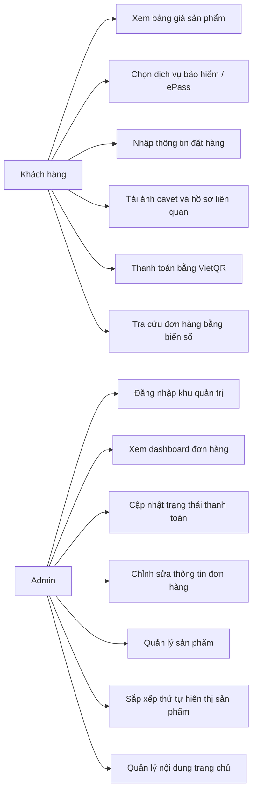
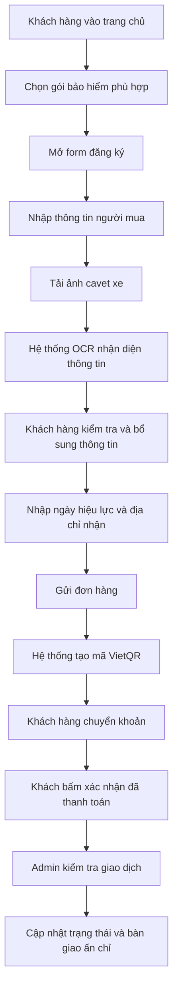
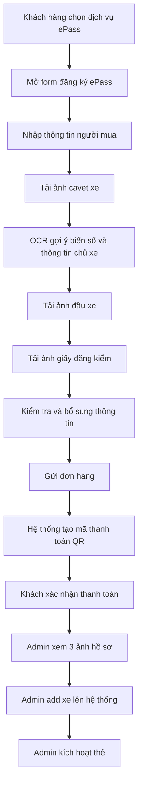
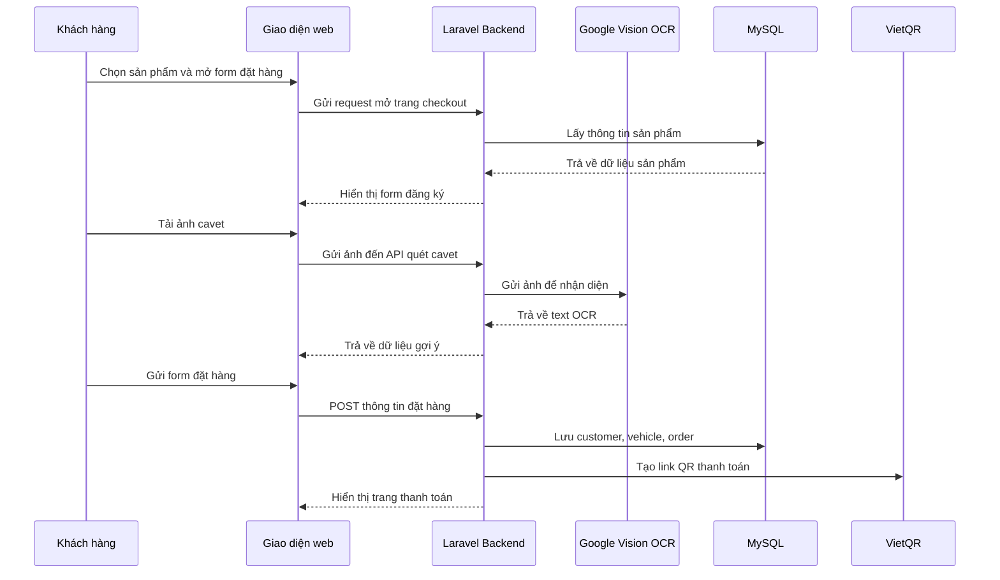
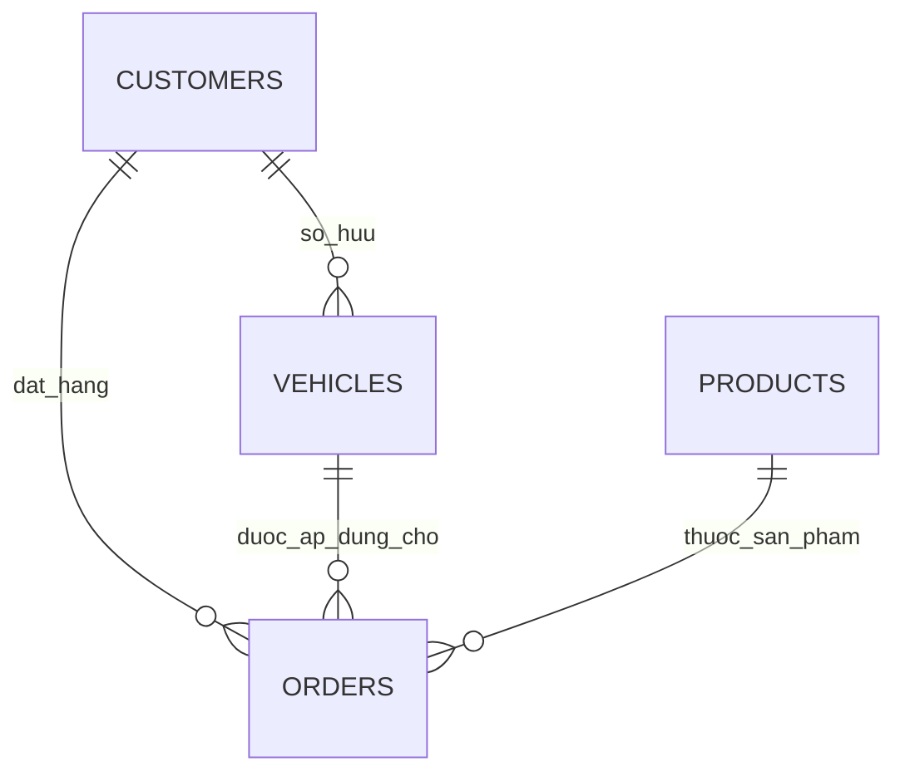

# BÁO CÁO HOÀN CHỈNH MÔN THƯƠNG MẠI ĐIỆN TỬ

## ĐỀ TÀI: XÂY DỰNG WEBSITE HỖ TRỢ ĐĂNG KÝ BẢO HIỂM Ô TÔ VÀ DỊCH VỤ EPASS TRÊN NỀN TẢNG LARAVEL

---

## LỜI CẢM ƠN

Trước hết, em xin bày tỏ lòng biết ơn chân thành đến Quý Thầy, Cô giảng dạy môn Thương mại điện tử đã truyền đạt những kiến thức nền tảng và chuyên sâu trong suốt quá trình học tập. Những kiến thức về mô hình kinh doanh số, quy trình giao dịch trực tuyến, quản trị hệ thống và trải nghiệm người dùng chính là cơ sở quan trọng để em thực hiện và hoàn thiện đề tài này.

Em xin chân thành cảm ơn Giảng viên phụ trách môn học đã tận tình định hướng đề tài, góp ý về nội dung, phương pháp tiếp cận cũng như cách trình bày báo cáo. Những nhận xét và góp ý của Thầy, Cô đã giúp em nhìn nhận rõ hơn bài toán thực tế, từ đó hoàn thiện sản phẩm theo hướng ứng dụng và khoa học hơn.

Em cũng xin gửi lời cảm ơn đến gia đình, bạn bè và những người đã luôn động viên, hỗ trợ em trong suốt quá trình học tập và thực hiện đồ án. Mặc dù đã có nhiều cố gắng, song do giới hạn về thời gian, kinh nghiệm và phạm vi nghiên cứu, báo cáo chắc chắn vẫn còn những thiếu sót nhất định. Em rất mong nhận được những ý kiến đóng góp quý báu từ Thầy, Cô để đề tài được hoàn thiện hơn trong thời gian tới.

---

## LỜI MỞ ĐẦU

Trong bối cảnh chuyển đổi số đang diễn ra mạnh mẽ, thương mại điện tử không còn giới hạn ở hoạt động mua bán hàng hóa thông thường mà đã mở rộng sang nhiều lĩnh vực dịch vụ chuyên biệt. Đối với các dịch vụ liên quan đến ô tô như bảo hiểm bắt buộc, đăng ký thẻ thu phí không dừng ePass và tra cứu tiến độ hồ sơ sau giao dịch, nhu cầu số hóa quy trình ngày càng trở nên cấp thiết. Việc ứng dụng nền tảng trực tuyến không chỉ giúp giảm chi phí vận hành mà còn góp phần nâng cao chất lượng phục vụ khách hàng, tăng tính minh bạch và rút ngắn thời gian xử lý nghiệp vụ.

Trên thực tế, quá trình đăng ký bảo hiểm xe ô tô hoặc dịch vụ ePass tại nhiều đơn vị hiện nay vẫn còn được thực hiện theo phương thức phân tán và thủ công. Khách hàng thường phải liên hệ qua nhiều kênh khác nhau để hỏi giá, gửi giấy tờ qua ứng dụng nhắn tin, nhận hướng dẫn thanh toán bằng tin nhắn văn bản, sau đó tiếp tục chờ phản hồi thủ công từ nhân viên. Về phía doanh nghiệp, việc tiếp nhận và tổng hợp thông tin từ nhiều nguồn khiến quá trình xử lý dễ phát sinh sai sót, đặc biệt với các dữ liệu quan trọng như biển số xe, số khung, số máy hoặc thông tin chủ xe.

Xuất phát từ thực tế trên, đề tài được thực hiện với mục tiêu xây dựng một hệ thống website theo định hướng thương mại điện tử, có khả năng hỗ trợ trọn vẹn quy trình từ hiển thị thông tin dịch vụ, tiếp nhận hồ sơ, hỗ trợ nhập liệu bằng OCR, thanh toán trực tuyến bằng mã QR cho đến tra cứu trạng thái đơn hàng và quản trị nội dung. Đây không chỉ là một sản phẩm phục vụ học tập mà còn là mô hình mô phỏng khá sát với nhu cầu vận hành thực tế của doanh nghiệp dịch vụ quy mô nhỏ và vừa.

---

## 1. THÔNG TIN CHUNG VỀ ĐỀ TÀI

- Tên đề tài: Xây dựng website hỗ trợ đăng ký bảo hiểm ô tô và dịch vụ ePass trên nền tảng Laravel.
- Môn học: Thương mại điện tử.
- Nền tảng phát triển: Laravel 12, PHP 8.2, MySQL, Vite, Bootstrap và CSS tùy biến.
- Môi trường triển khai thử nghiệm: XAMPP trên Windows.
- Đối tượng sử dụng: khách hàng có nhu cầu mua bảo hiểm xe ô tô hoặc đăng ký ePass; quản trị viên chịu trách nhiệm tiếp nhận và xử lý hồ sơ.

## 2. LÝ DO CHỌN ĐỀ TÀI

Việc lựa chọn đề tài xuất phát từ nhiều nguyên nhân gắn với thực tế và yêu cầu học tập của môn Thương mại điện tử. Trước hết, nhu cầu mua bảo hiểm ô tô và đăng ký thẻ ePass là nhu cầu có thật, mang tính phổ biến và gắn với quá trình chuyển đổi số trong lĩnh vực giao thông. Tuy nhiên, nhiều đơn vị vẫn đang xử lý nghiệp vụ theo phương thức bán thủ công hoặc bán “nửa trực tuyến”, dẫn đến trải nghiệm khách hàng chưa tốt và chi phí vận hành cao.

Bên cạnh đó, đề tài có tính ứng dụng rõ rệt trong lĩnh vực thương mại điện tử dịch vụ. Hệ thống không chỉ đóng vai trò là website giới thiệu sản phẩm mà còn đảm nhiệm chức năng tiếp nhận giao dịch, quản lý dữ liệu khách hàng, hỗ trợ thanh toán, theo dõi trạng thái đơn hàng và quản trị nội dung kinh doanh. Đây là những thành phần cốt lõi của một nền tảng thương mại điện tử hiện đại.

Ngoài ý nghĩa thực tiễn, đề tài còn phù hợp với mục tiêu học tập vì cho phép vận dụng nhiều kiến thức đã học như thiết kế cơ sở dữ liệu, mô hình MVC, xây dựng quy trình giao dịch điện tử, tích hợp công cụ hỗ trợ xử lý dữ liệu và tối ưu trải nghiệm người dùng.

## 3. MỤC TIÊU NGHIÊN CỨU

Mục tiêu tổng quát của đề tài là xây dựng một website theo hướng thương mại điện tử nhằm hỗ trợ cung cấp dịch vụ bảo hiểm ô tô và ePass, giúp khách hàng có thể xem thông tin, lựa chọn dịch vụ, gửi hồ sơ trực tuyến, thanh toán qua mã QR, theo dõi trạng thái đơn hàng; đồng thời hỗ trợ quản trị viên quản lý sản phẩm, đơn hàng và nội dung hiển thị một cách tập trung.

Các mục tiêu cụ thể bao gồm:

- Xây dựng giao diện trang chủ hiện đại, rõ ràng, có khả năng phân loại dịch vụ tốt.
- Hỗ trợ hai luồng nghiệp vụ riêng biệt là bảo hiểm ô tô và ePass.
- Tích hợp OCR để hỗ trợ nhập liệu từ ảnh cavet xe.
- Tích hợp thanh toán bằng VietQR.
- Xây dựng dashboard quản trị đơn hàng và quản trị nội dung trang chủ.

## 4. ĐỐI TƯỢNG VÀ PHẠM VI NGHIÊN CỨU

Đối tượng nghiên cứu của đề tài bao gồm quy trình tiếp nhận và xử lý hồ sơ dịch vụ bảo hiểm ô tô, quy trình tiếp nhận và xử lý hồ sơ ePass, hành vi thao tác của khách hàng trên website và quy trình xử lý nội bộ của quản trị viên.

Trong phạm vi đề tài, hệ thống tập trung thực hiện các chức năng cốt lõi như hiển thị dịch vụ, tiếp nhận hồ sơ, hỗ trợ OCR, thanh toán QR, tra cứu đơn hàng, quản lý sản phẩm và quản lý nội dung. Những nội dung như tài khoản khách hàng, báo cáo doanh thu hay phân quyền nhiều cấp chưa được triển khai chuyên sâu ở phiên bản hiện tại.

## 5. MÔ HÌNH HOẠT ĐỘNG THƯƠNG MẠI ĐIỆN TỬ

Hệ thống được xây dựng theo mô hình B2C đơn giản. Doanh nghiệp cung cấp thông tin dịch vụ lên website, khách hàng truy cập để xem bảng giá, lựa chọn gói phù hợp, gửi hồ sơ trực tuyến, thanh toán và theo dõi tiến độ. Sau khi tiếp nhận thanh toán, quản trị viên xử lý đơn hàng và cập nhật kết quả trực tiếp lên hệ thống.

Mô hình này phù hợp với đặc trưng của thương mại điện tử dịch vụ vì giá trị hệ thống không chỉ nằm ở giai đoạn bán hàng mà còn nằm ở khả năng tổ chức quy trình sau bán, bao gồm xác minh thanh toán, kiểm tra hồ sơ, cấp phát kết quả và hỗ trợ khách hàng tra cứu tiến độ.

## 6. PHÂN TÍCH NGHIỆP VỤ HỆ THỐNG

### 6.1. Nghiệp vụ mua bảo hiểm ô tô

Quy trình mua bảo hiểm ô tô trong hệ thống được thiết kế theo các bước: khách hàng truy cập trang chủ, xem bảng giá, lựa chọn nhóm xe, mở form đăng ký, tải ảnh giấy đăng ký xe, nhận hỗ trợ nhập liệu bằng OCR, bổ sung thông tin còn thiếu, nhập ngày hiệu lực, gửi đơn hàng và thanh toán bằng mã QR. Sau đó, quản trị viên xác minh thanh toán, xử lý hồ sơ và cập nhật kết quả để khách hàng tra cứu.

### 6.2. Nghiệp vụ đăng ký ePass

Luồng ePass được tổ chức riêng do có đặc thù khác với bảo hiểm. Khách hàng vẫn tải ảnh cavet để hệ thống OCR nhận diện biển số và thông tin cơ bản, nhưng đồng thời phải bổ sung ảnh đầu xe và ảnh giấy đăng kiểm để nhân viên có thể add xe và kích hoạt thẻ trên hệ thống nội bộ.

### 6.3. Nghiệp vụ quản trị nội dung

Admin có thể chỉnh sửa các khối nội dung cố định trên trang chủ như tiêu đề, mô tả, slogan và ảnh carousel. Tuy nhiên, hệ thống chỉ cho phép thay đổi nội dung trong các trường định nghĩa sẵn, không cho phép thay đổi cấu trúc giao diện nhằm đảm bảo ổn định bố cục.

## 7. YÊU CẦU CHỨC NĂNG

### 7.1. Chức năng dành cho khách hàng

- Xem trang chủ và danh mục dịch vụ.
- Chọn sản phẩm bảo hiểm hoặc ePass.
- Nhập thông tin người mua và phương tiện.
- Upload ảnh hồ sơ.
- Sử dụng OCR để tự động điền một phần dữ liệu.
- Thanh toán bằng mã QR.
- Xác nhận đã thanh toán.
- Tra cứu đơn hàng theo biển số xe.

### 7.2. Chức năng dành cho quản trị viên

- Đăng nhập khu vực quản trị.
- Theo dõi danh sách đơn hàng.
- Xem chi tiết từng hồ sơ.
- Cập nhật trạng thái thanh toán và giao nhận.
- Chỉnh sửa thông tin đơn hàng.
- Quản lý sản phẩm.
- Sắp xếp thứ tự hiển thị sản phẩm.
- Quản lý nội dung trang chủ.

## 8. YÊU CẦU PHI CHỨC NĂNG

Hệ thống phải đảm bảo các tiêu chí như: giao diện dễ sử dụng, khả năng xử lý ổn định, độ chính xác cao trong nhận diện dữ liệu, bảo mật các thông tin nhạy cảm, dễ mở rộng và hiển thị tốt trên nhiều kích thước màn hình.

## 9. CÔNG NGHỆ SỬ DỤNG

- Laravel 12: framework backend chính.
- PHP 8.2: ngôn ngữ xử lý nghiệp vụ phía server.
- MySQL: hệ quản trị cơ sở dữ liệu.
- Blade Template: xây dựng giao diện động.
- Bootstrap, CSS tùy biến và Vite: xây dựng và build giao diện.
- Google Vision OCR: nhận diện thông tin từ ảnh cavet.
- VietQR: hỗ trợ thanh toán qua mã QR.

## 10. THIẾT KẾ HỆ THỐNG

Hệ thống được xây dựng theo mô hình MVC, trong đó Model quản lý dữ liệu, View đảm nhiệm giao diện hiển thị và Controller xử lý nghiệp vụ. Ngoài ra, hệ thống sử dụng middleware cho bảo mật khu vực admin, Form Request để kiểm soát dữ liệu đầu vào và bộ test để đảm bảo độ ổn định.

### Các controller chính

- `HomeController`: hiển thị trang chủ và danh sách sản phẩm.
- `OrderController`: xử lý checkout, OCR, thanh toán và tra cứu đơn hàng.
- `AdminController`: quản lý dashboard đơn hàng.
- `AdminProductController`: quản lý sản phẩm.
- `AdminHomepageContentController`: quản lý nội dung trang chủ.

## 11. SƠ ĐỒ USE CASE

Sơ đồ use case thể hiện rõ hai nhóm tác nhân chính là khách hàng và quản trị viên. Điều này phản ánh đúng đặc điểm của hệ thống thương mại điện tử dịch vụ, nơi khách hàng thực hiện giao dịch còn quản trị viên chịu trách nhiệm kiểm soát và vận hành.

## 12. SƠ ĐỒ HOẠT ĐỘNG QUY TRÌNH MUA BẢO HIỂM

## 13. SƠ ĐỒ HOẠT ĐỘNG QUY TRÌNH EPASS

## 14. SƠ ĐỒ TUẦN TỰ ĐẶT HÀNG

## 15. THIẾT KẾ CƠ SỞ DỮ LIỆU

Các bảng dữ liệu chính của hệ thống bao gồm:

- `products`: lưu danh mục sản phẩm bảo hiểm và ePass.
- `customers`: lưu thông tin khách hàng.
- `vehicles`: lưu thông tin phương tiện và ảnh hồ sơ.
- `orders`: lưu giao dịch, trạng thái thanh toán và thông tin giao nhận.
- `site_settings`: lưu nội dung động của trang chủ.

## 16. SƠ ĐỒ ERD

Mô hình quan hệ dữ liệu được tổ chức theo hướng chặt chẽ, trong đó `orders` đóng vai trò trung tâm kết nối giữa khách hàng, phương tiện và sản phẩm. Riêng `site_settings` được tách biệt nhằm phục vụ quản trị nội dung mà không ảnh hưởng đến các bảng nghiệp vụ.

## 17. THIẾT KẾ GIAO DIỆN VÀ TRẢI NGHIỆM NGƯỜI DÙNG

Giao diện được cải tiến theo hướng hiện đại, sáng, rõ và dễ thao tác. Trang chủ sử dụng header có khả năng thu gọn khi cuộn, hero section nổi bật, carousel, khu bảo hiểm tách theo biển trắng và biển vàng, cùng khu ePass được trình bày rõ ràng dưới dạng danh mục dịch vụ.

Trang đăng ký được chia theo từng khối thông tin để người dùng dễ hoàn thành hồ sơ. Dashboard admin được tối ưu theo hướng trực quan nhưng vẫn giữ tính thực dụng nhằm phục vụ thao tác xử lý nội bộ.

### Bảng so sánh trước và sau khi cải tiến giao diện

| Tiêu chí | Trước cải tiến | Sau cải tiến |
|---|---|---|
| Header | Đơn giản | Có trạng thái thu gọn khi cuộn |
| Trang chủ | Nặng tính bảng biểu | Có hero, carousel, chips điều hướng |
| Checkout | Thiên về form kỹ thuật | Bố cục rõ khối, dễ đọc |
| Admin | Phục vụ kỹ thuật là chính | Gọn, sáng và dễ quét hơn |

## 18. SO SÁNH QUY TRÌNH THỦ CÔNG VÀ SỐ HÓA

| Nội dung | Cách làm thủ công | Cách làm trên hệ thống |
|---|---|---|
| Báo giá | Nhắn tin thủ công | Hiển thị công khai trên website |
| Gửi giấy tờ | Gửi qua ứng dụng chat | Upload trực tiếp trên form |
| Nhập thông tin | Nhân viên nhập tay | Hệ thống hỗ trợ OCR |
| Thanh toán | Chuyển khoản theo hướng dẫn thủ công | Có mã VietQR theo đơn |
| Tra cứu | Hỏi lại qua điện thoại/tin nhắn | Tra cứu theo biển số |
| Chỉnh nội dung | Sửa code hoặc dữ liệu tay | Chỉnh trong dashboard |

## 19. CÁC CHỨC NĂNG NỔI BẬT ĐÃ HOÀN THIỆN

### 19.1. Quản lý sản phẩm

Admin có thể thêm, sửa, ẩn, hiện và kéo thả sắp xếp sản phẩm. Chức năng này giúp việc điều chỉnh danh mục trở nên thuận tiện và phù hợp với nhu cầu vận hành thực tế.

### 19.2. Quản lý nội dung trang chủ

Hệ thống có cơ chế CMS mini cho phép admin cập nhật slogan, tiêu đề, mô tả và ảnh carousel mà không cần can thiệp mã nguồn. Đây là điểm nổi bật giúp nâng cao tính chủ động cho đơn vị vận hành.

### 19.3. OCR cavet xe

OCR được tích hợp để hỗ trợ nhận diện dữ liệu từ ảnh cavet. Hệ thống ưu tiên tìm biển số trong vùng ngữ cảnh phù hợp, sau đó chuẩn hóa dữ liệu trước khi đưa vào biểu mẫu, nhờ đó giúp giảm sai sót khi nhập tay.

### 19.4. Thanh toán VietQR

Mỗi đơn hàng đều có mã thanh toán riêng, giúp khách hàng thanh toán nhanh và giúp admin đối chiếu giao dịch thuận tiện hơn.

### 19.5. Tra cứu đơn hàng

Khách hàng có thể nhập biển số xe để tra cứu đơn. Hệ thống hỗ trợ chuẩn hóa biển số nhằm tăng khả năng tìm kiếm đúng kết quả.

### 19.6. Dashboard admin

Dashboard admin cho phép xem danh sách đơn, xem chi tiết hồ sơ, cập nhật trạng thái, chỉnh sửa thông tin và theo dõi ảnh hồ sơ đầy đủ theo từng loại dịch vụ.

## 20. PHÂN TÍCH CHUYÊN SÂU MỘT SỐ CHỨC NĂNG

### 20.1. Chức năng OCR

Điểm mạnh của chức năng OCR nằm ở việc hệ thống không chỉ gửi ảnh đi nhận diện rồi trả kết quả thô, mà còn áp dụng thêm bước xử lý hậu kỳ để tăng độ tin cậy. Điều này đặc biệt quan trọng do ảnh cavet thực tế thường bị nghiêng, lóa hoặc chất lượng không đồng đều.

### 20.2. Chức năng CMS mini

CMS mini được xây dựng theo nguyên tắc “mở nội dung nhưng khóa bố cục”. Đây là hướng đi phù hợp cho hệ thống thương mại điện tử quy mô nhỏ và vừa, nơi cần đảm bảo tính linh hoạt trong vận hành nhưng vẫn duy trì tính nhất quán và ổn định của giao diện.

## 21. BẢO MẬT VÀ TỐI ƯU HỆ THỐNG

Hệ thống đã được cải tiến ở nhiều điểm như đưa API key và cấu hình thanh toán về `.env`, bảo vệ khu vực admin bằng middleware, dùng Form Request cho validation, xử lý mềm các lỗi dữ liệu trùng và chặn việc xóa sản phẩm đã phát sinh đơn hàng. Những cải tiến này làm tăng tính an toàn và khả năng bảo trì của hệ thống.

## 22. KIỂM THỬ HỆ THỐNG

Hệ thống đã được xây dựng bộ kiểm thử cho các luồng nghiệp vụ quan trọng nhằm đảm bảo tính ổn định khi vận hành và khi tiếp tục mở rộng. Việc có test là một điểm mạnh đáng ghi nhận vì thể hiện tính cẩn trọng trong phát triển phần mềm.

### Bảng tổng hợp kiểm thử

| STT | Chức năng kiểm thử | Kết quả mong đợi | Kết quả thực tế |
|---|---|---|---|
| 1 | Đăng nhập admin | Truy cập được dashboard | Đạt |
| 2 | Cập nhật trạng thái đơn | Trạng thái được lưu | Đạt |
| 3 | Tạo đơn bảo hiểm | Lưu đúng dữ liệu | Đạt |
| 4 | Tạo đơn ePass | Lưu đúng ảnh và dữ liệu | Đạt |
| 5 | OCR biển số | Trích xuất đúng định dạng | Đạt |
| 6 | Tra cứu đơn | Tìm được đơn phù hợp | Đạt |
| 7 | Thêm sản phẩm | Sản phẩm hiển thị trong admin | Đạt |
| 8 | Sắp xếp sản phẩm | Thứ tự hiển thị thay đổi đúng | Đạt |
| 9 | Chặn xóa sản phẩm có đơn | Không vi phạm khóa ngoại | Đạt |
| 10 | Cập nhật nội dung trang chủ | Nội dung mới hiển thị ngoài frontend | Đạt |

## 23. ĐÁNH GIÁ ƯU ĐIỂM VÀ HẠN CHẾ

### 23.1. Ưu điểm

- Đề tài giải quyết bài toán thực tế trong lĩnh vực dịch vụ ô tô.
- Hệ thống có đầy đủ các thành phần cốt lõi của thương mại điện tử dịch vụ.
- Tích hợp OCR giúp giảm thao tác nhập liệu.
- Có sự phân tách rõ ràng giữa luồng bảo hiểm và ePass.
- Giao diện được cải tiến theo hướng hiện đại và thân thiện.
- Admin có thể quản trị sản phẩm và nội dung mà không cần sửa mã nguồn.
- Mã nguồn được tổ chức rõ ràng theo Laravel.
- Có bộ kiểm thử cho các chức năng quan trọng.

### 23.2. Hạn chế

- Chưa có đăng nhập tài khoản khách hàng.
- Chưa tích hợp thông báo tự động qua email hoặc SMS.
- Chưa có dashboard thống kê doanh thu và hiệu quả kinh doanh.
- OCR vẫn phụ thuộc vào chất lượng ảnh đầu vào.
- Chưa có phân quyền nhiều cấp trong khu vực admin.

## 24. HƯỚNG PHÁT TRIỂN TRONG TƯƠNG LAI

Trong thời gian tới, hệ thống có thể được mở rộng theo các hướng như: xây dựng tài khoản khách hàng, bổ sung thống kê doanh thu, tích hợp thông báo tự động, mở rộng CMS cho nhiều trang khác, thêm phân quyền admin nhiều cấp và kết nối với các nền tảng thanh toán trực tuyến phong phú hơn.

## 25. KẾT LUẬN

Thông qua quá trình phân tích, thiết kế, xây dựng và hoàn thiện hệ thống, đề tài đã đạt được mục tiêu đặt ra là xây dựng một website theo hướng thương mại điện tử hỗ trợ đăng ký bảo hiểm ô tô và ePass trên nền tảng Laravel. Hệ thống không chỉ đáp ứng các chức năng cơ bản của một website dịch vụ trực tuyến mà còn thể hiện được tính ứng dụng thực tế thông qua việc tích hợp quy trình tiếp nhận hồ sơ, hỗ trợ OCR, sinh mã thanh toán QR, tra cứu đơn hàng và quản trị nội dung.

Kết quả của đề tài cho thấy việc ứng dụng công nghệ web vào lĩnh vực dịch vụ ô tô có thể tạo ra nhiều giá trị cụ thể: giảm thời gian thao tác, giảm sai sót khi nhập liệu, tăng tính chuyên nghiệp trong khâu tư vấn và giúp người dùng chủ động hơn trong quá trình giao dịch. Đồng thời, đề tài cũng chứng minh rằng một hệ thống được xây dựng đúng hướng, dù ở quy mô học tập, vẫn có thể phản ánh khá rõ mô hình hoạt động của thương mại điện tử trong thực tế.

Về mặt học thuật, đề tài giúp người thực hiện vận dụng tổng hợp nhiều kiến thức quan trọng như phân tích nghiệp vụ, thiết kế cơ sở dữ liệu, lập trình web theo mô hình MVC, tổ chức giao diện, tối ưu trải nghiệm người dùng và kiểm thử hệ thống. Đây là những kỹ năng nền tảng không chỉ phục vụ môn học mà còn có giá trị lâu dài trong quá trình học tập và làm việc sau này.

## 26. NHẬN XÉT CÁ NHÂN

Thông qua đề tài này, người thực hiện có cơ hội tiếp cận một bài toán có tính thực tế cao, nơi các yêu cầu kỹ thuật luôn gắn chặt với yêu cầu nghiệp vụ. Quá trình xây dựng hệ thống giúp củng cố khả năng phân tích, thiết kế, tổ chức dữ liệu và triển khai giải pháp theo hướng vừa đảm bảo kỹ thuật, vừa chú trọng trải nghiệm người dùng.

Một bài học quan trọng rút ra là trong thương mại điện tử, giá trị của hệ thống không chỉ nằm ở giao diện đẹp hay tính năng nhiều, mà nằm ở khả năng kết nối các bước trong hành trình của người dùng thành một quy trình mạch lạc, rõ ràng và đáng tin cậy.

## 27. TÀI LIỆU THAM KHẢO

- Tài liệu chính thức của Laravel.
- Tài liệu PHP.
- Tài liệu MySQL.
- Tài liệu Google Vision OCR.
- Tài liệu VietQR.
- Giáo trình môn Thương mại điện tử.

## 28. PHỤ LỤC GỢI Ý ĐỂ BÁO CÁO ĐẠT TRÊN 20 TRANG

Để báo cáo khi dàn trang trong Word đạt trên 20 trang, nên bổ sung ảnh chụp màn hình của các trang chính như trang chủ, trang đăng ký, trang tra cứu, trang thanh toán QR, dashboard admin, trang quản lý sản phẩm và trang quản lý nội dung. Ngoài ra, nên chú thích từng hình, giãn dòng hợp lý và giữ định dạng tiêu đề rõ ràng. Với cấu trúc hiện tại, chỉ cần chèn thêm ảnh và lời dẫn, báo cáo hoàn toàn có thể đạt từ 20 đến 25 trang.
